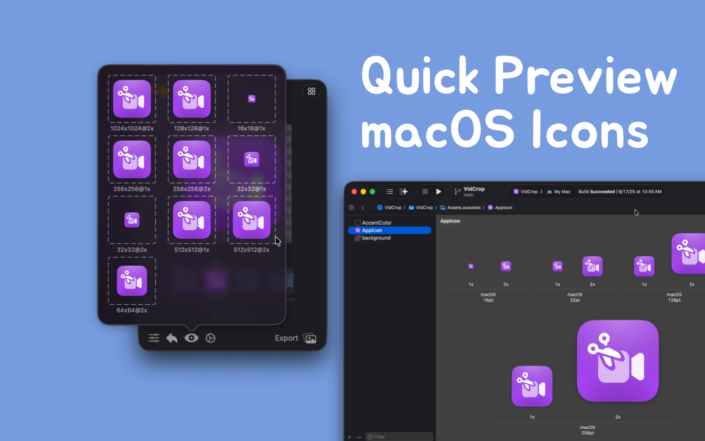

   
   
  
  <h1>
    Iconed
  </h1>
  <!--rehype:style=border: 0;-->
  

    <a href="./README.zh.md">简体中文</a> • 
    <a href="https://github.com/jaywcjlove/iconed/issues/new?assignees=jaywcjlove&labels=support%2Cfeedback%2Cquestion&projects=&template=bug_report.yml&title=%F0%9F%99%8B%E2%80%8D%E2%99%82%EF%B8%8F+Support+%26+Feedback%3A+iconed">Contact & Support</a> • 
    <a href="https://github.com/jaywcjlove/iconed/releases">Changelog</a>
  

  

    
  

Create and personalize icons from images, supporting macOS/iOS icon generation, folder icon creation, and setting.

- **Folder Icons**: Quickly customize and set your folder icons.
- **App Icons**: Supports all operating systems, helping you import any image and convert it into a complete, usable app icon. Compatible with various icon formats required by Apple platforms (iOS and macOS).
- **Icon Format Conversion**: Easily convert icons to other formats to meet the needs of different platforms.

This tool helps you create any type of icon for your application, converting images into the required 1x, 2x (retina), and 3x formats, and generating corresponding image sets.
