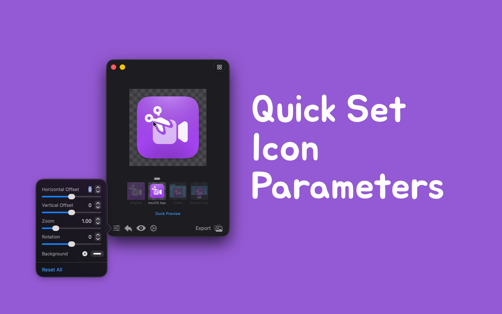

<div align="center">
  <br />
  <br />
  
  <h1>
    Iconed
  </h1>
  <!--rehype:style=border: 0;-->
  <p>
    <a href="./README.md">English</a> • 
    <a href="https://github.com/jaywcjlove/iconed/issues/new?assignees=jaywcjlove&labels=support%2Cfeedback%2Cquestion&projects=&template=bug_report_cn.yml&title=%F0%9F%99%8B%E2%80%8D%E2%99%82%EF%B8%8F+%E6%94%AF%E6%8C%81%E4%B8%8E%E5%8F%8D%E9%A6%88%3A+iconed">联系&支持</a> • 
    <a href="https://github.com/jaywcjlove/iconed/releases">变更日志</a>
  </p>
  <p>
    <a target="_blank" href="https://apps.apple.com/app/iconed/id6739444407" title="Iconed for macOS">
      
    </a>
  </p>
</div>





轻松从图片创建和个性化图标，支持 macOS 和 iOS 图标生成、文件夹图标创建与设置，并提供图标格式转换功能。

- **文件夹图标**：通过简单的操作，快速自定义并设置您的文件夹图标，让您的文件夹更加个性化和独特。
- **应用程序图标**：兼容所有操作系统，支持将任意图像导入并转换为完整、可用的应用程序图标。特别适配 Apple 平台（iOS 和 macOS），支持各种所需图标格式，满足不同应用场景。
- **图标格式转换**：轻松将图标转换为其他格式，支持常见的图标格式，如 PNG、JPEG、TIFF 等，方便您在不同平台间切换使用。

该工具能帮助您为应用程序创建任何图标，自动转换为所需的 1x、2x（视网膜）和 3x 格式，并生成完整的图像集，确保在所有设备和分辨率下都能完美显示。

## URL Scheme

**Iconed** 支持通过 URL Scheme 激活工具，并传递命令和参数以导入指定路径的图片进行编辑。

```shell
iconed:///Users/wangchujiang/Desktop/chrome.svg
```

从 Terminal.app 或命令行调用

```shell
open "iconed:///Users/wangchujiang/Desktop/chrome.svg"
```

在浏览器中调用，将以下地址复制到浏览器地址栏并按 Enter 键：

```shell
iconed:///Users/wangchujiang/Desktop/chrome.svg
```